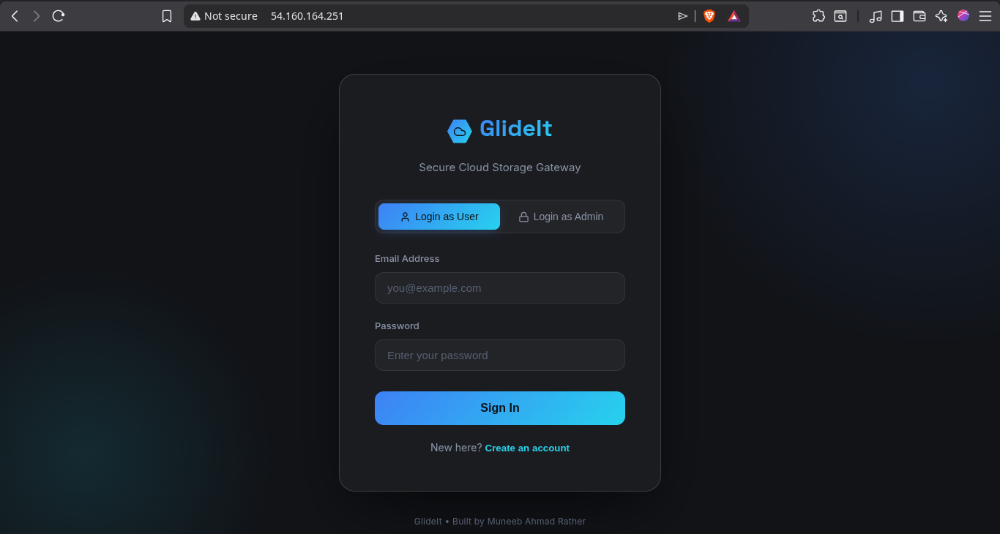
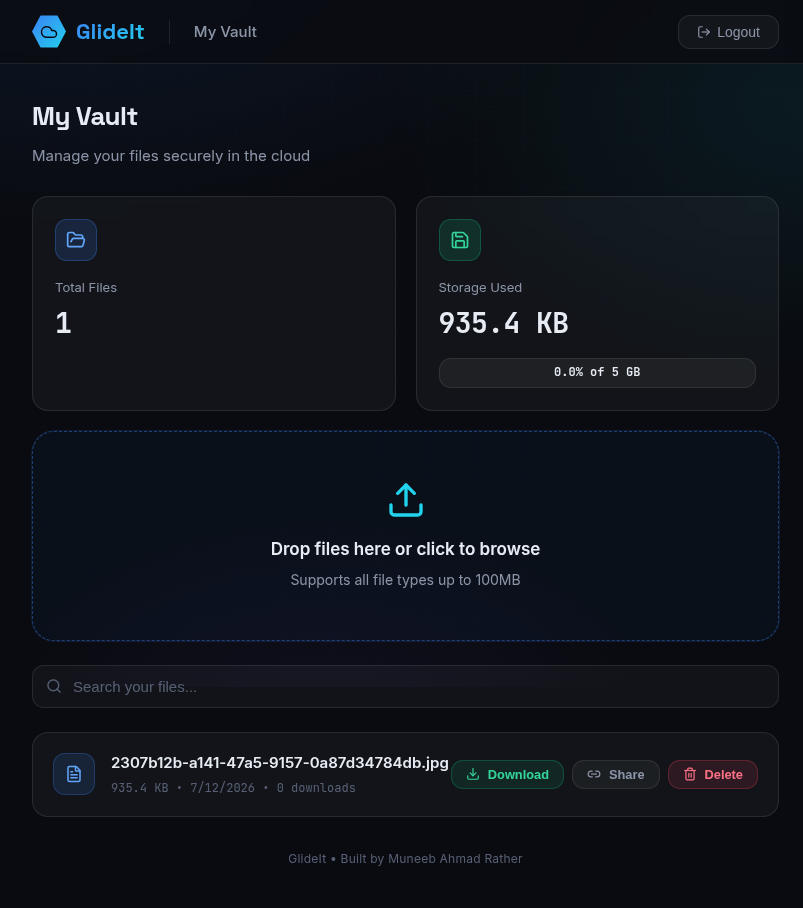
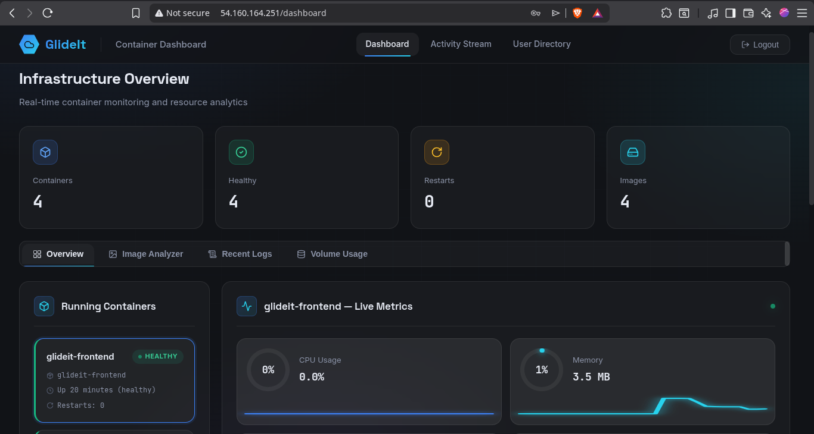
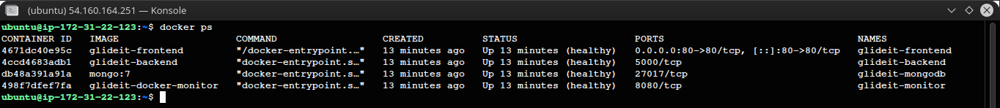
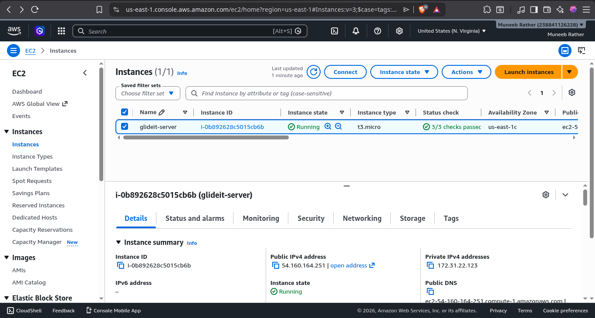
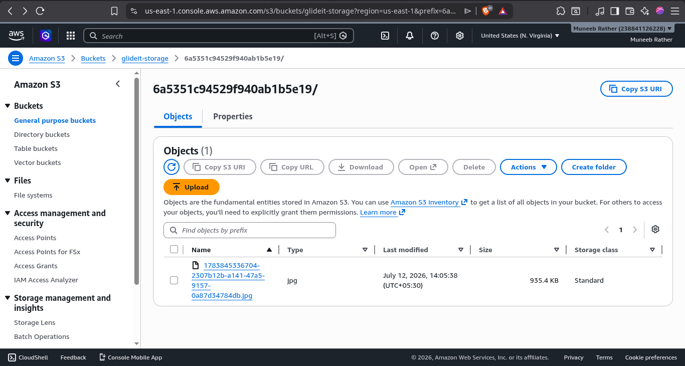

# 🚀 GlideIt

A cloud-native file storage and container monitoring platform deployed on AWS EC2 with IAM role-based S3 integration, built with the MERN stack and Docker.

## 📖 Overview

GlideIt was built to go beyond a typical CRUD app and demonstrate an end-to-end AWS deployment: IAM roles instead of hardcoded access keys, a live view into the containers actually running the app, and infrastructure shipped the way a production system would be. It pairs a standard MERN file-storage app with a real-time Docker monitoring layer, so the same login that lets a user manage their files lets an admin watch the infrastructure underneath it.

## ✨ Features
- 🔐 **JWT Authentication** — Role-based access (User / Admin)
- ☁️ **Cloud File Storage** — Upload, download, delete files stored in Amazon S3
- 🐳 **Docker Container Monitoring** — Real-time CPU, memory, network stats
- 📊 **Live Dashboard** — Radial gauges, sparklines, memory bars with shimmer
- 📋 **Activity Stream** — Audit logging for all user actions
- 👥 **User Directory** — Admin user management with role badges
- 🎨 **Futuristic Dark UI** — Glassmorphism, neon accents, smooth animations

## 🛠️ Tech Stack

| Layer | Technology |
|---|---|
| Frontend | React 18, React Router, Lucide React |
| Backend | Node.js, Express, JWT, bcrypt |
| Database | MongoDB, Mongoose|
| Cloud Storage | AWS S3 (IAM role authentication) |
| Compute | AWS EC2 (t2.micro, Ubuntu 22.04) |
| Auth | AWS IAM role — no hardcoded AWS credentials |
| Monitoring | Docker Engine API, Server-Sent Events |
| Deployment | Docker Compose on EC2 |
| Proxy | Nginx (serves the multi-stage-built frontend) |

## ☁️ AWS Architecture

```
                       User Browser
                            │
                            ▼
            ┌────────────────────────────────┐
            │       AWS EC2 (t2.micro)        │
            │       Ubuntu 22.04 LTS          │
            │   IAM Role: glideit-ec2-role    │
            └────────────────┬─────────────────┘
                              │
            ┌─────────────────┼──────────────────┐
            │                 │                  │
            ▼                 ▼                  ▼
      ┌───────────┐     ┌───────────┐     ┌───────────────┐
      │   Nginx   │     │  Backend  │     │ Docker Monitor│
      │   :80     │     │  :5000    │     │    :8080      │
      │  (React)  │     │ (Express, │     │   (SSE API)   │
      │           │     │  JWT auth)│     │               │
      └─────┬─────┘     └─────┬─────┘     └───────────────┘
            │                 │
            │                 ▼
            │           ┌───────────┐
            │           │  MongoDB  │
            │           │  (volume) │
            │           └─────┬─────┘
            │                 │
            └────────────►┌───────────┐
                           │  AWS S3   │
                           │  Bucket   │
                           │(IAM role) │
                           └───────────┘
```

**AWS services used**
- **EC2** — compute instance (t2.micro) running Docker Compose
- **S3** — object storage for uploaded files
- **IAM** — role-based authentication (no access keys in code)
- **Security Groups** — firewall rules (22, 80)

**Four containers on EC2**
- `glideit-frontend` — React build + Nginx reverse proxy
- `glideit-backend` — Express API + JWT auth + S3 integration
- `glideit-mongodb` — MongoDB with persistent volume
- `glideit-monitor` — Docker Engine API monitoring service

## 📸 Screenshots

**Login Page**


**My Vault — Cloud File Storage**


**Admin Dashboard — Container Monitoring**


**Docker Containers Running on EC2**
All four containers running successfully with Docker Compose.


**AWS EC2 Instance**
EC2 instance running with IAM role attached.


**AWS S3 Bucket with Uploaded File**
File stored in S3 bucket, uploaded through the web application.


## 📁 Project Structure

```
glideit/
├── backend/
│   ├── src/
│   │   ├── index.js
│   │   ├── config/db.js
│   │   ├── routes/
│   │   │   ├── auth.js
│   │   │   ├── files.js
│   │   │   └── admin.js
│   │   ├── models/
│   │   │   ├── User.js
│   │   │   ├── File.js
│   │   │   └── AuditLog.js
│   │   ├── middleware/
│   │   │   ├── auth.js
│   │   │   └── admin.js
│   │   └── utils/
│   │       ├── s3.js
│   │       └── dockerMonitor.js
│   ├── package.json
│   └── Dockerfile
│
├── frontend/
│   ├── public/
│   ├── src/
│   │   ├── App.js
│   │   ├── components/
│   │   │   ├── Login.js
│   │   │   ├── MyVault.js
│   │   │   ├── ContainerDashboard.js
│   │   │   ├── ActivityStream.js
│   │   │   ├── UserDirectory.js
│   │   │   ├── App.css
│   │   │   └── ...
│   │   ├── context/AuthContext.js
│   │   └── services/
│   ├── nginx.conf
│   ├── package.json
│   └── Dockerfile
│
├── docker-monitor/
│   ├── src/
│   ├── package.json
│   └── Dockerfile
│
├── screenshots/
│   ├── login.png
│   ├── vault.png
│   ├── dashboard.png
│   ├── docker.png
│   ├── ec2.png
│   └── s3.png
│
├── docker-compose.yaml
├── .env.example
├── .gitignore
├── .dockerignore
└── README.md
```

## 🚀 Getting Started

### Prerequisites
- Docker & Docker Compose
- AWS account (for S3 + EC2 deployment)

### Local Development
```bash
git clone https://github.com/MuneebRather/glideit.git
cd glideit

# Copy environment variables
cp .env.example .env
# Edit .env with your AWS S3 bucket and JWT secret

docker compose up --build
```
Open `http://localhost`

## ☁️ AWS Deployment Guide

### Step 1: Create S3 Bucket
- AWS Console → **S3** → Create bucket
- **Bucket name:** `glideit-storage-yourname` (must be globally unique)
- **Region:** `us-east-1` (or closest to you)
- **Block all public access:** Yes (default)
- Click **Create bucket**

### Step 2: Create IAM Role for EC2
- AWS Console → **IAM** → Roles → Create role
- **Trusted entity type:** AWS service
- **Use case:** EC2
- Attach policy: `AmazonS3FullAccess` *(fine for a learning project — scope this down to just your bucket if you ever run this for real)*
- **Role name:** `glideit-ec2-role`
- Click **Create role**

### Step 3: Launch EC2 Instance
- AWS Console → **EC2** → Launch instance
- **Name:** `glideit-server`
- **AMI:** Ubuntu Server 22.04 LTS (free tier eligible)
- **Instance type:** `t2.micro`
- **Key pair:** Create new → `glideit-key` → download `.pem`
- **Network settings:**
  - Create security group `glideit-sg`
  - Inbound rules: SSH (22) → My IP, HTTP (80) → Anywhere
- **Advanced details → IAM instance profile:** `glideit-ec2-role`
- Click **Launch instance**

### Step 4: Configure `.env` on the server
```
NODE_ENV=production
MONGODB_URI=mongodb://glideit-mongodb:27017/glideit
JWT_SECRET=your-secret-key
S3_BUCKET=glideit-storage-yourname
AWS_REGION=us-east-1
# No AWS_ACCESS_KEY_ID or AWS_SECRET_ACCESS_KEY — the IAM role handles auth
```

### Step 5: SSH into EC2
```bash
chmod 400 glideit-key.pem
ssh -i glideit-key.pem ubuntu@YOUR_EC2_PUBLIC_IP
```

### Step 6: Install Docker
```bash
curl -fsSL https://get.docker.com | sudo sh
sudo usermod -aG docker $USER
newgrp docker
docker --version
```

### Step 7: Copy project to EC2
```bash
rsync -avz -e "ssh -i glideit-key.pem" \
  --exclude='**/node_modules' --exclude='.git' --exclude='glideit-key.pem' \
  . ubuntu@YOUR_EC2_PUBLIC_IP:/home/ubuntu/glideit
```

### Step 8: Run on EC2
```bash
cd /home/ubuntu/glideit
docker compose up --build -d
```

### Step 9: Access the app
Open `http://YOUR_EC2_PUBLIC_IP` in a browser.

## 🔒 Security Features
- JWT authentication with role-based access control (User / Admin)
- Password hashing with bcrypt
- AWS IAM role for S3 access — no hardcoded AWS credentials
- MongoDB authentication enabled
- Nginx reverse proxy with API routing
- Admin-only routes protected by middleware
- Security group — SSH restricted to a specific IP, HTTP open

## 🎯 Skills Demonstrated

### Frontend
- React 18
- React Router

### Backend
- Node.js
- Express.js
- REST API Design
- JWT Authentication

### Database
- MongoDB
- Mongoose

### DevOps
- Docker
- Docker Compose
- Nginx Reverse Proxy

### AWS
- EC2
- IAM
- S3

### Linux
- Ubuntu Server Administration

## 👤 Author
**Muneeb Ahmad Rather**
GitHub: (https://github.com/MuneebRather)

## 📄 License
MIT License